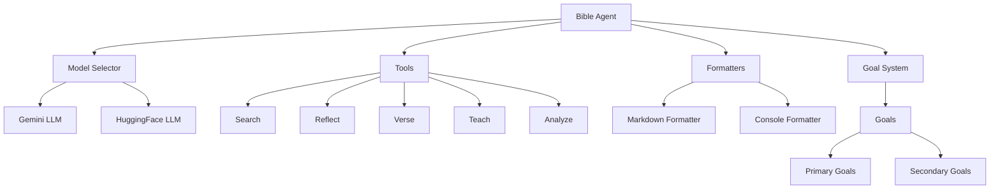

# Bible Study AI Agent 🤖📚

An intelligent agent system for biblical study and analysis, combining modern AI with scriptural wisdom.

## Architecture



## Features

- 🤖 **Intelligent Model Selection**: Dynamically chooses between Gemini and HuggingFace models
- 📖 **Daily Verse Generation**: Provides daily biblical verses with fallback mechanisms
- 🔍 **Biblical Search**: Combined AI and online source analysis
- 📚 **Teaching Generation**: Topic-specific biblical teachings
- 💭 **Passage Analysis**: Deep scriptural analysis with context and interpretations
- 📝 **Multiple Output Formats**: Console and Markdown formatting support
- 🎯 **Goal-Oriented System**: Prioritized goal system for focused interactions
- 💾 **Memory System**: Learns from past interactions

## Installation

1. Clone the repository:
```bash
git clone https://github.com/ashioyajotham/bible-study-agent.git
cd bible-study-agent
```

2. Create and activate virtual environment:
```bash
python -m venv venv
source venv/bin/activate  # Linux/Mac
# or
venv\Scripts\activate  # Windows
```

3. Install dependencies:
```bash
pip install -r requirements.txt
```

4. Set up environment variables:
```bash
cp .env.example .env
```

Edit `.env` file with your API keys:
```
SERPER_API_KEY=your_serper_key
GEMINI_API_KEY=your_gemini_key
HF_MODEL_ID=your_huggingface_model
```

## Usage

### Interactive Mode
```python
from agent.bible_agent import BibleAgent, handle_interactive_mode

agent = BibleAgent()
handle_interactive_mode(agent)
```

### Available Commands
- `verse`: Get daily Bible verse
- `teach`: Get teachings on a specific topic
- `search`: Search for biblical insights
- `export`: Export study content to Markdown
- `quit`: Exit interactive mode

### Code Examples

```python
# Initialize agent
agent = BibleAgent()

# Get daily verse
verse = agent.get_daily_verse()

# Get teachings on a topic
teachings = agent.get_teachings("love")

# Search biblical insights
insights = agent.search_biblical_insights("forgiveness")

# Analyze a passage
analysis = agent.analyze_passage("John 3:16")

# Export to markdown
agent.export_to_markdown(
    {"verse": verse, "teaching": teachings}, 
    "study_notes"
)
```

## Project Structure

```
bible-study-agent/
├── src/
│   ├── agent/
│   │   ├── bible_agent.py
│   │   ├── base_agent.py
│   │   └── components/
│   │       └── goal_system.py
│   ├── services/
│   │   ├── llm/
│   │   │   ├── gemini_llm.py
│   │   │   ├── hf_llm.py
│   │   │   └── model_selector.py
│   │   └── serper_service.py
│   ├── utils/
│   │   └── formatters/
│   │       ├── markdown_formatter.py
│   │       └── console_formatter.py
│   └── models/
│       └── verse.py
├── config/
│   └── settings.py
└── requirements.txt
```

## Dependencies

- Python 3.8+
- Google Gemini API
- HuggingFace Transformers
- Serper API
- requests
- python-dotenv

## Contributing

Contributions are welcome! Please feel free to submit a Pull Request.

## License

This project is licensed under the MIT License - see the LICENSE file for details.
