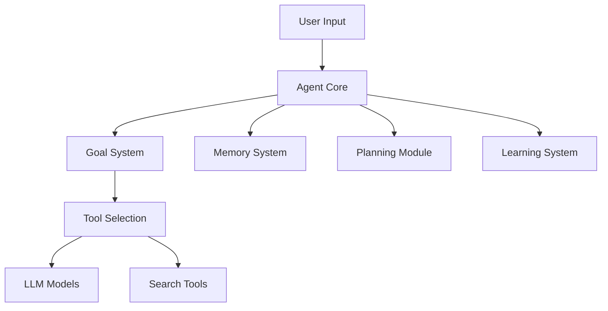

# Scripture AI Agent

An autonomous AI agent for biblical study and research, powered by multiple LLMs and equipped with self-learning capabilities.

## Agent Architecture

This system implements a true autonomous agent with:

- **Self-Directed Goals**: Dynamically adjusts objectives based on context
- **Memory Systems**: Short-term and long-term memory for learning
- **Planning Module**: Strategic action planning with fallback mechanisms
- **Learning Component**: Adapts strategies based on experience
- **Tool Integration**: Dynamic selection of LLMs and search capabilities
- **State Management**: Tracks agent state and confidence levels
- **Reflection System**: Continuous self-evaluation and improvement

### Core Components



## Overview
The Scripture AI Agent is a Python-based application designed to provide users with daily Bible verses, teachings of Jesus Christ, and insightful summaries from online sources. The agent leverages the capabilities of Foundation Models and the Serper API to enhance user experience and deliver relevant content.

## Features
- **Daily Verses**: Fetches and displays daily Bible verses.
- **Teachings of Jesus**: Provides insights into the teachings of Jesus Christ.
- **Online Insights**: Searches for additional insights and summaries from the web.
- **Llama 3 and Gemini Integration**: Utilizes LLMs for generating responses and enhancing user interaction.

## Project Structure
```
scripture-ai-agent/
├── src/
│   ├── agent/
│   │   ├── __init__.py
│   │   ├── bible_agent.py
│   │   └── search_agent.py
│   ├── services/
│   │   ├── __init__.py
│   │   ├── serper_service.py
│   │   └── llm/
│   │       ├── __init__.py
│   │       ├── base_llm.py
│   │       ├── gemini_llm.py
│   │       └── hf_llm.py
│   ├── models/
│   │   ├── __init__.py
│   │   └── verse.py
│   ├── config/
│   │   ├── __init__.py
│   │   └── settings.py
│   └── utils/
│       ├── __init__.py
│       └── helpers.py
├── requirements.txt
├── setup.py
└── README.md
```

## Installation
1. Clone the repository:
   ```
   git clone https://github.com/ashioyajotham/bible.git

   ```
2. Navigate to the project directory:
   ```
   cd bible
   ```
3. Install the required dependencies:
   ```
   pip install -r requirements.txt
   ```

4. Install the package in development mode:
   ```
   pip install -e .
   ```
5. Verify installation
   ```
   bible --version
   ```


## Usage
To run the application, execute the following command:
```
python src/main.py

# Interactive Mode
bible --interactive

# Get Daily Verse
bible --verse

# Search Biblical Insights
bible --search "faith and works"

# Get teaching on a topic
bible --teaching "love your enemies"

# Get insights on a topic
bible --insights "christian living"

# Export study insights to a file
bible --export study.md

# Get the agent version
bible --version

# Exit the interactive mode
exit
```

```
Arguments:
  --interactive, -i  Run the agent in interactive mode
  --verse, -v        Get the daily Bible verse
  --search, -s       Search for biblical insights
```


Alternatively, you can use the agent in your Python code:

```python
from bible import BibleAgent

agent = BibleAgent()

# Get daily verse with reflection
verse = agent.get_daily_verse()
reflection = agent.generate_reflection(verse)

# Search biblical insights
insights = agent.search_biblical_insights("faith and works")

# Interactive mode
agent.start_interactive_session()
```

## Advanced Usage Examples
```
# Create a weekly study plan
agent = BibleAgent()
topics = ["faith", "hope", "love"]
for topic in topics:
    insights = agent.search_biblical_insights(topic)
    verses = agent.get_related_verses(topic)
    print(f"\n{topic.upper()} STUDY")
    print("Insights:", insights)
    print("Key Verses:", verses)

# Export study results
with open("study_results.md", "w") as f:
    f.write(f"# Bible Study Results\n\n")
    f.write(f"## Daily Verse\n{agent.get_daily_verse()}\n\n")
    f.write(f"## Reflections\n{agent.generate_reflection(verse)}")
```

## Configuration
- Update the `.env` file with your API keys and other sensitive information.
- Modify `config/settings.py` for any additional configuration settings.

## Contributing
Contributions are welcome! Please submit a pull request or open an issue for any suggestions or improvements.

## License
This project is licensed under the MIT License. See the LICENSE file for details.
